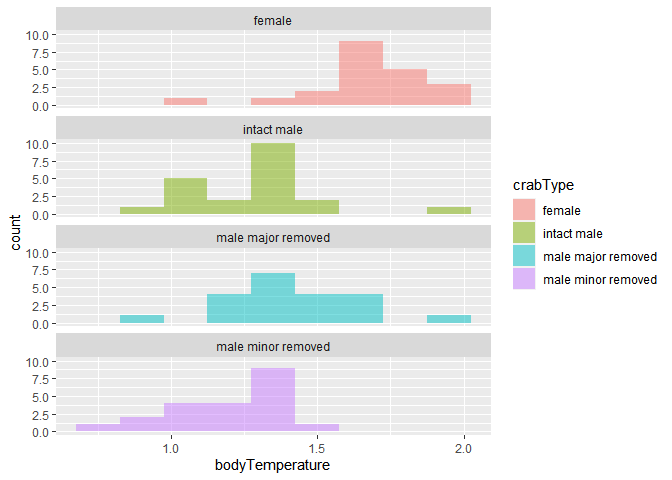

Lab 6 Comparing means
================
SImeon Alfa
2021-05-13

Fill out this report and submit it as your completed assignment.

You can view the R markdown script that created this report here:
[README.Rmd](README.Rmd)

## *t*-test

Researchers studying the number of electric fish species living in
various parts of the Amazon basin were interested in whether the
presence of tributaries affected the local number of electric fish
species in the main rivers (Fernandes et al. 2004).

They counted the number of electric fish species above and below the
entrance point of a major tributary at 12 different river locations.

The data is provided in your GitHub repository.

For each question below, write a sentence answering the question and
show the code you used to come up with the answer, if applicable.

``` r
library(tidyverse)
```

    ## -- Attaching packages --------------------------------------- tidyverse 1.3.0 --

    ## v ggplot2 3.3.3     v purrr   0.3.4
    ## v tibble  3.1.0     v dplyr   1.0.5
    ## v tidyr   1.1.3     v stringr 1.4.0
    ## v readr   1.4.0     v forcats 0.5.1

    ## -- Conflicts ------------------------------------------ tidyverse_conflicts() --
    ## x dplyr::filter() masks stats::filter()
    ## x dplyr::lag()    masks stats::lag()

``` r
fish <- read_csv("chap12q19ElectricFish.csv")
```

    ## 
    ## -- Column specification --------------------------------------------------------
    ## cols(
    ##   tributary = col_character(),
    ##   speciesUpstream = col_double(),
    ##   speciesDownstream = col_double()
    ## )

``` r
fish_long <-
  pivot_longer(fish, speciesUpstream:speciesDownstream,
               names_to = "location",
               values_to = "species") %>%
  mutate(location = str_remove(location, c("species"))) %>%
  print()
```

    ## # A tibble: 24 x 3
    ##    tributary location   species
    ##    <chr>     <chr>        <dbl>
    ##  1 Içá       Upstream        14
    ##  2 Içá       Downstream      19
    ##  3 Jutaí     Upstream        11
    ##  4 Jutaí     Downstream      18
    ##  5 Japurá    Upstream         8
    ##  6 Japurá    Downstream       8
    ##  7 Coari     Upstream         5
    ##  8 Coari     Downstream       7
    ##  9 Purus     Upstream        10
    ## 10 Purus     Downstream      16
    ## # ... with 14 more rows

### Question A

> Test the hypothesis that the tributaries have no effect on the number
> of species of electric fish.

``` r
fish_ttest <- t.test(species ~ location, data = fish_long)
diff(fish_ttest$estimate)
```

    ## mean in group Upstream 
    ##              -1.833333

ANSWER NUll Hypothesis: The tributaries have no effect on the number of
species electric fish Alternate Hypothesis: The tributaries have an
effect in the number of electric fish We failed to reject the null
hypothesis as p&gt;0.05 and thus its not significantly different.The
tributaries have no effect on the number of species of electric fish.

### Question B

> What is the difference in the mean numbers of species between areas
> upstream and downstream of a tributary? What is the 95% confidence
> interval of this difference in means?

ANSWER The difference in the mean numbers of species between areas
upstream and downstream of a tributary = -1.83 95% confidence interval
of the difference in means = between -4.59 and 8.25.

### Question C

> State the assumptions that you had to make to complete parts (A) and
> (B). Create a graph to assess whether one of those assumptions was
> met.

ANSWER I made the assumption that the paired differences have a normal
distribution in populations.

``` r
fish_long %>%
  ggplot(aes(x = location, y = tributary)) +
  geom_jitter(aes(color = location),
  shape = 16, alpha = 0.9, width = 0.9)
```

<!-- -->

## ANOVA

Fiddler crabs are so called because males have a greatly enlarged
“major” claw, which is used to attract females and to defend a burrow.

Darnell and Munguia (2011) recently suggested that this appendage might
also act as a heat sink, keeping males cooler while out of the burrow on
hot days.

To test this, they placed four groups of crabs into separate plastic
cups and supplied a source of radiant heat (60-watt light bulb) from
above. The four groups were intact male crabs, male crabs with the major
claw removed; male crabs with the other (minor) claw removed (control);
and intact female fiddler crabs.

They measured the body temperature of crabs every 10 minutes for 1.5
hours. These measurements were used to calculate a rate of heat gain for
every individual crab in degrees C/log minute. Rates of heat gain for
all crabs are provided in the accompanying data file.

### Question D

> Graph the distribution of body temperatures for each crab type:

``` r
crab <- read_csv("chap15q27FiddlerCrabFans.csv")
```

    ## 
    ## -- Column specification --------------------------------------------------------
    ## cols(
    ##   crabType = col_character(),
    ##   bodyTemperature = col_double()
    ## )

``` r
crab %>% 
  filter(!is.na(crabType)) %>% 
  ggplot(aes(x = bodyTemperature)) +
  geom_histogram(
    aes(fill = crabType), 
    bins = 9, 
    alpha = 0.5, 
    position = "identity" 
  ) +
  facet_wrap( ~ crabType, ncol = 1) 
```

<!-- -->

### Question E

> Does body temperature vary among crab types? State the null and
> alternative hypothesis, conduct and ANOVA, and interpret the results.

``` r
aov_crab <-
  aov(bodyTemperature ~ crabType, data = crab)
aov_crab
```

    ## Call:
    ##    aov(formula = bodyTemperature ~ crabType, data = crab)
    ## 
    ## Terms:
    ##                 crabType Residuals
    ## Sum of Squares  2.641310  3.467619
    ## Deg. of Freedom        3        80
    ## 
    ## Residual standard error: 0.2081952
    ## Estimated effects may be unbalanced
    ## 1 observation deleted due to missingness

# ANSWER

Null hypothesis:Temperature does not vary between crab types Alternative
hypothesis:Temperature varies between crab types The results of the
ANOVA show that the F value is greater than one and this means the
alternative hypothesis is supported. The p-value is &lt;0.05 which means
that the null hypothesis is rejected and there is at least one crab type
is different from the others.
